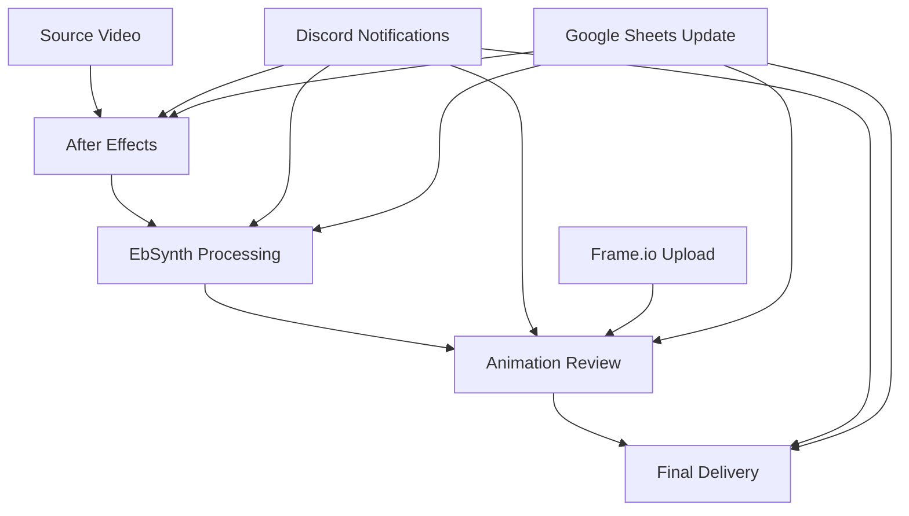

# 🎬 RL PostFlow

[](https://python.org)
[](LICENSE)
[](tests/)
[](https://github.com/resizelab/rl_postflow/releases)

> **Pipeline de post-production automatisé pour documentaire animé**  
> Traitement et suivi de 516 plans sur 25 scènes avec intégrations professionnelles

## 🚀 Fonctionnalités Principales

### 📊 **Pipeline de Production**
- **12 statuts de plan** : De `pending` à `final_delivery`
- **5 stages de production** : Source → After Effects → EbSynth → Review → Delivery
- **Tracking temps réel** : Progression automatique et gestion d'erreurs
- **Processing par scène** : Traitement batch intelligent

### 🔗 **Intégrations**
- **Discord** : Notifications automatiques avec embeds riches
- **Frame.io** : Upload et review automatisés
- **Google Sheets** : Synchronisation bidirectionnelle
- **LucidLink** : Vérification des fichiers sources
- **After Effects** : Pipeline de traitement automatisé

### 🎯 **Monitoring**
- **Dashboard web** : Interface de monitoring en temps réel
- **Gestion d'erreurs** : Système de retry et alertes
- **Métriques** : Suivi des performances et statistiques

## 📂 Structure du Projet

```
rl_postflow/
├── 🚀 main.py                  # Point d'entrée principal
├── 📊 dashboard.py             # Dashboard web de monitoring
├── 📦 src/                     # Code source modulaire
│   ├── utils/                  # Utilitaires (ErrorHandler, FileWatcher)
│   ├── integrations/           # Intégrations externes
│   ├── workflows/              # Workflows de production
│   └── models/                 # Modèles de données
├── 🧪 tests/                   # Tests organisés
│   ├── unit/                   # Tests unitaires
│   ├── integration/            # Tests d'intégration
│   └── fixtures/               # Données de test
├── 🛠️ scripts/                 # Scripts utilitaires
├── 🎨 examples/                # Exemples et démos
└── 📚 docs/                    # Documentation
```

## ⚡ Installation Rapide

```bash
# Cloner le projet
git clone https://github.com/resizelab/rl_postflow.git
cd rl_postflow

# Créer l'environnement virtuel
python -m venv .venv
source .venv/bin/activate  # macOS/Linux

# Installation automatique
python scripts/install_dependencies.py
```

## 🎮 Utilisation

### Pipeline Principal
```bash
python main.py              # Parser CSV + Export
python dashboard.py         # Dashboard web
```

### Exemples
```bash
python examples/pipeline_demo.py     # Démo complète
python examples/export_by_scene.py   # Export par scène
```

### Tests
```bash
python scripts/quick_test.py    # Tests rapides
pytest tests/unit/              # Tests unitaires
pytest tests/ --cov=src         # Tests avec coverage
```

## 🎯 Workflow de Production



## 🧪 Tests & Qualité

- **Tests unitaires** : 26 tests couvrant les modules principaux
- **Tests d'intégration** : Validation du workflow complet
- **Coverage** : Couverture de code avec pytest-cov
- **Qualité** : Structure professionnelle et documentation

## 📈 Métriques

| Métrique | Valeur |
|----------|--------|
| **Plans** | 516 |
| **Scènes** | 25 |
| **Statuts** | 12 |
| **Intégrations** | 5 |
| **Tests** | 26+ |

## 🤝 Contribution

1. **Fork** le projet
2. **Créer** une branche feature (`git checkout -b feature/amazing-feature`)
3. **Commit** les changements (`git commit -m 'Add amazing feature'`)
4. **Push** vers la branche (`git push origin feature/amazing-feature`)
5. **Ouvrir** une Pull Request

## 📄 License

Ce projet est sous licence MIT - voir le fichier [LICENSE](LICENSE) pour plus de détails.

## 🎉 Remerciements

- **Resize Lab** pour le développement
- **Communauté Python** pour les outils
- **Équipe de production** pour les retours

---

<div align="center">
  <b>🎬 Fait avec ❤️ par Resize Lab</b>
</div>
