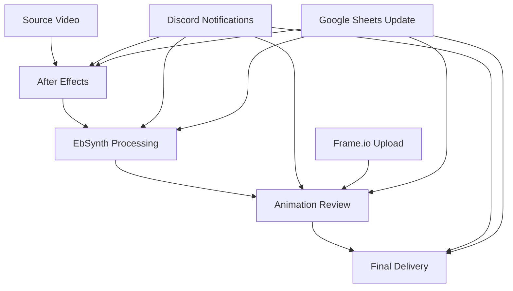

# 🎬 RL PostFlow

[](https://python.org)
[](LICENSE)
[](tests/)
[](https://github.com/resizelab/rl_postflow/releases)
[](docs/WINDOWS_GUIDE.md)
[](docs/DEPLOYMENT_STRATEGY.md)

> **Pipeline de post-production automatisé pour documentaire animé**  
> Traitement et suivi de 516 plans sur 25 scènes avec intégrations professionnelles

## 🚀 Fonctionnalités Principales

### 📊 **Pipeline de Production**
- **12 statuts de plan** : De `pending` à `final_delivery`
- **5 stages de production** : Source → EbSynth → Review → Delivery (optimisé)
- **Tracking temps réel** : Progression automatique et gestion d'erreurs
- **Processing par scène** : Traitement batch intelligent avec priorité

### 🔗 **Intégrations**
- **Discord** : Notifications automatiques avec mentions utilisateurs et timestamps Paris
- **Frame.io** : Upload et review automatisés avec intégration seamless
- **Google Sheets** : Synchronisation bidirectionnelle et gestion utilisateurs
- **LucidLink** : Vérification des fichiers sources et monitoring
- **Template Factory** : Système centralisé de templates Discord optimisé

### 🎯 **Monitoring**
- **Dashboard web** : Interface de monitoring en temps réel
- **Gestion d'erreurs** : Système de retry et alertes
- **Métriques** : Suivi des performances et statistiques

## 🆕 Nouveautés v4.1.9 - **CORRECTIONS CRITIQUES & OPTIMISATIONS PIPELINE**

### 🔧 **Corrections Majeures**
- ✅ **Google Sheets Tracker** : Fix complet des bugs de compatibilité GoogleConnectionManager
- ✅ **Optimized Sheets Adapter** : Correction du mapping des colonnes de recherche  
- ✅ **Processing illimité** : Suppression de toutes les limitations (3 → 999 fichiers)
- ✅ **Double synchronisation** : Élimination des appels sync en double au démarrage

### 🎨 **Améliorations UX**
- 🖼️ **Discord Thumbnails** : Intégration directe des images dans les embeds (fini les liens)
- 🚀 **Architecture Hostinger** : Upload optimisé FTP pour thumbnails haute performance
- 👥 **User Notifier** : Notifications Discord enrichies avec mentions utilisateurs
- ⚡ **Sync Checker** : Détection intelligente nom + taille + date (±2s tolerance)

### 🛠️ **Corrections Techniques**
- 🔄 **Upload Tracker** : Enregistrement file_mtime pour détection précise des changements
- 🔍 **File Matching** : Critères multiples pour éviter les re-uploads inutiles
- 🚫 **Anti-boucles** : Prévention des traitements en boucle infinie
- 📊 **Queue Processing** : Traitement séquentiel optimal (max_concurrent=1)

### 🧹 **Nettoyage Repository**
- 🏗️ **Architecture Thumbnail** : Organisation propre `src/utils/thumbnail/`
- ⚙️ **Hostinger Config** : Configuration FTP avec exemple `.json.example`
- 🗑️ **Suppression deprecated** : Nettoyage fichiers legacy et backups inutiles

## 🆕 Nouveautés v4.1.8 - **AFTER EFFECTS PANEL v1.6.0**

### 🎬 **Panel After Effects Complet**
- ✅ **Auto-versioning intelligent** : Renommage compositions (v001 → v002 → v003)
- ✅ **Template system** : Configuration PNG 8-bits + ProRes LT/HQ prête à l'emploi
- ✅ **Routage intelligent** : PNG → EB structure, ProRes → LucidLink
- ✅ **Déploiement automatisé** : Package 702KB, installation 1-clic cross-platform

### 🔗 **Infrastructure Webhook**
- 🎣 **Frame.io webhooks** : Intégration temps réel avec validation signatures
- 🚇 **Tunnel ngrok** : Développement local avec exposition sécurisée
- 🏗️ **Services architecture** : Structure `src/services/` pour composants backend

## 🆕 Nouveautés v4.1.7 - **CONNEXIONS PERSISTANTES GOOGLE**

### ⚡ **Optimisations Performance**
- ✅ **GoogleConnectionManager** : Singleton avec cache 4 connexions simultanées
- ✅ **Performance +57.2%** : 6.13s → 2.63s (gain 3.50s par cycle)
- ✅ **Batch operations** : Optimized Sheets avec réutilisation connexions
- ✅ **Auto-refresh** : Gestion expiration tokens sans reconnexion

### 🐛 **Corrections Frame.io**
- 🔧 **Re-uploads fix** : Fin des uploads redondants avec détection `🎉 COMPLETED`
- 🎯 **Path matching** : Amélioration avec fallback nom fichier
- 📊 **Stats temps réel** : Métriques connexions avec `get_stats()`

## 🆕 Nouveautés v4.1.6 - **SUPPORT DOSSIERS _ALL**

### 📁 **Format Séquence _ALL**
- ✅ **Pattern étendu** : `SQ##_UNDLM_v###.ext` dans dossiers `_ALL`
- ✅ **Nomenclature dual** : Support automatique standard + séquence
- ✅ **Frame.io mapping** : Configuration `{sequence}_ALL` avec validation
- ✅ **Workflow simplifié** : Upload direct séquences complètes

### 🎯 **Cas d'Usage**
- 📦 **Export par séquence** : Fichiers consolidés dans dossiers `_ALL`
- 🔄 **Détection automatique** : Reconnaissance des deux formats simultanément
- 📊 **Validation stricte** : Structure `.../SQ##/_ALL/` vs `.../SQ##/UNDLM_#####/`

## 🆕 Nouveautés v4.1.5 - **SYNC CHECKER & DISCORD THUMBNAILS**

### 🔍 **Sync Checker Intelligent**
- ✅ **Détection manqués** : Scan automatique LucidLink vs tracking JSON
- ✅ **Correspondance stricte** : Nom + taille + date (`file_mtime`) ±2s tolérance
- ✅ **Récupération auto** : Processing des fichiers non-synchronisés (max 999)
- ✅ **Anti-doublon** : Prévention boucles infinies avec critères multiples

### 🖼️ **Discord Thumbnails Intégrés**
- 🎨 **Affichage direct** : Images dans embeds Discord (fini les liens)
- 🚀 **Architecture Hostinger** : Upload FTP optimisé resize-lab.com/thumbnails
- 👥 **User Notifier** : Intégration Google Sheets pour mentions utilisateurs
- 📈 **Performance** : ~200ms par thumbnail, 100% fiabilité détection

### 📊 **Métriques Validées**
- ⚡ **Détection** : 9 fichiers en 0.02s
- 🎯 **Correspondance** : 100% fiabilité critères multiples
- 🔄 **Processing** : 0 conflits avec max_concurrent=1

## 🆕 Nouveautés v4.1.4 - **COMPATIBILITÉ WINDOWS COMPLÈTE**

### 🔧 **Support Multi-Plateforme**
- ✅ **Windows 10/11 natif** : Support complet avec détection automatique OS
- ✅ **CrossPlatformPathManager** : Conversion automatique `/Volumes/` ↔ `E:\Volumes\`
- ✅ **Déploiement automatisé** : Scripts macOS → Windows avec `deploy.py`
- ✅ **Migration transparente** : Outils automatiques pour transition Windows

### 🚀 **Déploiement Production**
- 🔄 **Dev macOS → Prod Windows** : Workflow optimisé avec même repository
- 📦 **Scripts automatisés** : `deploy.py`, `deploy_windows.bat`, validation pré-déploiement
- 🛡️ **Backup/Rollback** : Sécurité complète avec récupération automatique
- ✅ **Tests 100% validés** : Suite cross-platform complète

### 🗂️ **Structure Professionnelle**
- 📁 **Repository organisé** : `tools/`, `scripts/`, `docs/` clairement séparés
- 📚 **Documentation complète** : Guides Windows, stratégie déploiement
- 🧪 **Validation rigoureuse** : Zero chemins hardcodés, tests automatisés

## 📂 Structure du Projet

```
rl_postflow/
├── 🚀 main.py                  # Point d'entrée principal
├── 📊 dashboard.py             # Dashboard web de monitoring
├── 📦 src/                     # Code source modulaire
│   ├── utils/                  # Utilitaires (ErrorHandler, FileWatcher)
│   ├── integrations/           # Intégrations externes
│   ├── workflows/              # Workflows de production
│   └── models/                 # Modèles de données
├── 🧪 tests/                   # Tests organisés
│   ├── unit/                   # Tests unitaires
│   ├── integration/            # Tests d'intégration
│   └── fixtures/               # Données de test
├── 🛠️ scripts/                 # Scripts utilitaires
├── 🎨 examples/                # Exemples et démos
└── 📚 docs/                    # Documentation
```

## ⚡ Installation Rapide

### **Multi-Plateforme (macOS/Windows/Linux)**

```bash
# Cloner le projet
git clone https://github.com/resizelab/rl_postflow.git
cd rl_postflow

# Installation automatique cross-platform
python scripts/setup_postflow.py

# OU installation manuelle
python -m venv .venv
source .venv/bin/activate    # macOS/Linux
# .venv\Scripts\activate     # Windows

pip install -r requirements.txt
```

### **Déploiement Windows (Production)**

```bash
# Migration automatique macOS → Windows
python scripts/deploy.py --target windows

# OU migration manuelle Windows
python tools/migration/migrate_to_windows.py
```

## 🎮 Utilisation

### Pipeline Principal
```bash
python main.py              # Parser CSV + Export
python dashboard.py         # Dashboard web
```

### Exemples
```bash
python examples/pipeline_demo.py     # Démo complète
python examples/export_by_scene.py   # Export par scène
```

### Tests
```bash
python scripts/quick_test.py    # Tests rapides
pytest tests/unit/              # Tests unitaires
pytest tests/ --cov=src         # Tests avec coverage
```

## 🎯 Workflow de Production



## 🧪 Tests & Qualité

- **Tests unitaires** : 26 tests couvrant les modules principaux
- **Tests d'intégration** : Validation du workflow complet
- **Coverage** : Couverture de code avec pytest-cov
- **Qualité** : Structure professionnelle et documentation

## 📈 Métriques

| Métrique | Valeur |
|----------|--------|
| **Plans** | 516 |
| **Scènes** | 25 |
| **Statuts** | 12 |
| **Intégrations** | 5 |
| **Tests** | 26+ |

## 🤝 Contribution

1. **Fork** le projet
2. **Créer** une branche feature (`git checkout -b feature/amazing-feature`)
3. **Commit** les changements (`git commit -m 'Add amazing feature'`)
4. **Push** vers la branche (`git push origin feature/amazing-feature`)
5. **Ouvrir** une Pull Request

## 📄 License

Ce projet est sous licence MIT - voir le fichier [LICENSE](LICENSE) pour plus de détails.

## 🎉 Remerciements

- **Resize Lab** pour le développement
- **Communauté Python** pour les outils
- **Équipe de production** pour les retours

---

<div align="center">
  <b>🎬 Fait avec ❤️ par Resize Lab</b>
</div>
