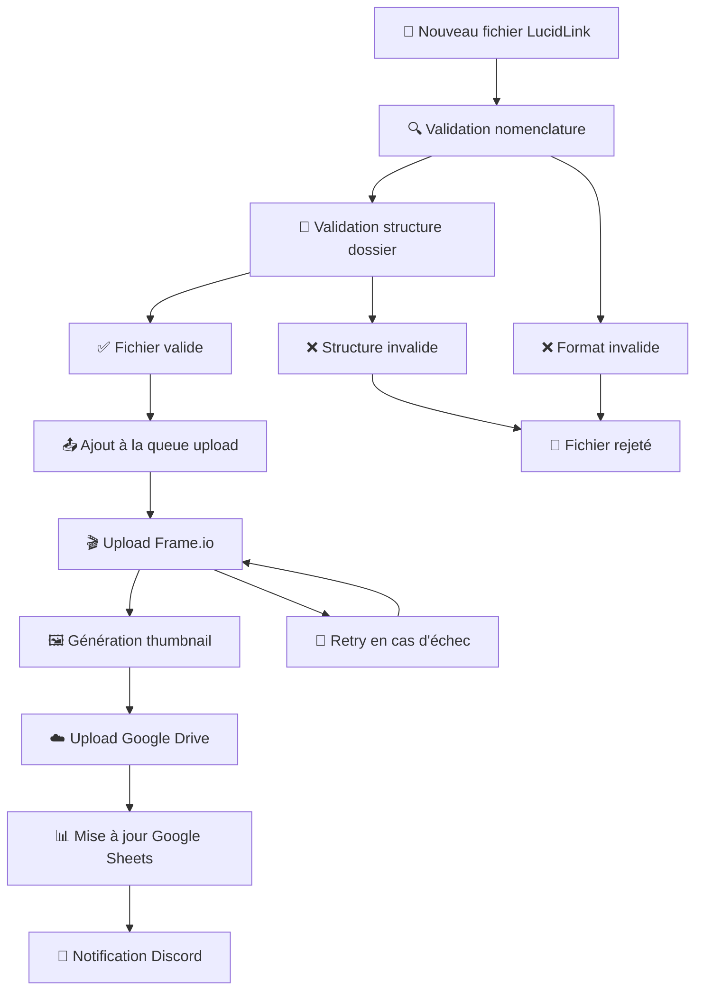

# 🎬 RL PostFlow - Pipeline d'Intégration LucidLink → Frame.io

[](https://python.org)
[](LICENSE)
[](tests/)
[](https://github.com/resizelab/rl_postflow/releases)

> **Pipeline automatisé de post-production pour l'upload intelligent de fichiers vidéo**  
> Surveillance temps réel LucidLink → Upload Frame.io avec validation stricte et intégrations complètes

## 🚀 Fonctionnalités Principales

### � **Surveillance Intelligente**
- **Watcher temps réel** : Détection automatique des nouveaux exports via LucidLink
- **Validation stricte** : Nomenclature `SQ##_UNDLM_#####_v###` obligatoire
- **Structure contrôlée** : Validation des chemins `.../SQxx/UNDLM_xxxxx/fichier`
- **Filtrage avancé** : Support multi-formats (MOV, MP4, AVI, MXF)

### 🎬 **Upload Frame.io Automatisé**
- **OAuth Web App** : Authentification sécurisée autonome
- **Upload intelligent** : Gestion automatique de la structure Frame.io
- **Liens de review** : Génération automatique des liens de visualisation
- **Retry mechanism** : Gestion des erreurs et nouvelles tentatives

### 🖼️ **Traitement Multimédia**
- **Thumbnails intelligents** : Génération via FFmpeg et upload Google Drive
- **Formules Google Sheets** : `=IMAGE()` et `=LIEN_HYPERTEXTE()` automatiques
- **Preview Discord** : Notifications avec miniatures intégrées
- **Métadonnées enrichies** : Extraction et tracking automatiques

### 📊 **Queue et Monitoring**
- **Queue intelligente** : Gestion des uploads multiples avec priorité
- **Dashboard web** : Interface de monitoring en temps réel sur port 8080
- **Tracking complet** : Suivi détaillé dans `uploads_tracking.json`
- **Métriques performance** : Statistiques et analytics intégrées

### 🔗 **Intégrations Complètes**
- **Discord** : Notifications automatiques avec embeds riches et thumbnails
- **Google Drive** : Stockage organisé des miniatures par date
- **Google Sheets** : Synchronisation bidirectionnelle avec formules automatiques
- **Frame.io** : Upload et gestion de review professionnelle
- **LucidLink** : Surveillance native du système de fichiers cloud

## 📂 Structure du Projet

```
rl_postflow/
├── 🚀 main.py                  # Point d'entrée du pipeline
├── � stop_postflow.py         # Arrêt propre du pipeline
├── 📦 src/                     # Code source modulaire
│   ├── core/                   # Composants centraux
│   │   ├── lucidlink_watcher.py    # Surveillance LucidLink
│   │   └── pipeline.py             # Orchestration workflow
│   ├── integrations/           # Intégrations externes
│   │   ├── frameio/               # Upload et review Frame.io
│   │   ├── sheets/                # Google Sheets API
│   │   └── discord/               # Notifications Discord
│   ├── utils/                  # Utilitaires
│   │   ├── upload_queue.py        # Gestion queue uploads
│   │   ├── upload_tracker.py      # Tracking état uploads
│   │   ├── thumbnail.py           # Génération miniatures
│   │   └── status_tracker.py      # Suivi statuts plans
│   └── bootstrap/              # Configuration et initialisation
├── 🧪 tests/                   # Tests organisés
│   ├── unit/                   # Tests unitaires
│   ├── integration/            # Tests d'intégration
│   └── fixtures/               # Données de test
├── 🛠️ scripts/                 # Scripts utilitaires et admin
├── 🔧 config/                  # Configuration (avec exemples)
├── 📊 data/                    # Données et tracking persistent
├── 🎨 examples/                # Exemples et démos
└── 📚 docs/                    # Documentation complète
```

## 📐 **Nomenclature et Validation**

### **Format de Fichier Strict**
```
SQ##_UNDLM_#####_v###.(mov|mp4|avi|mxf)
```

### **Structure de Dossier Obligatoire**
```
.../SQxx/UNDLM_xxxxx/SQxx_UNDLM_xxxxx_vyyy.mov
```

### **Exemples Valides** ✅
- `SQ01/UNDLM_00003/SQ01_UNDLM_00003_v001.mov`
- `SQ02/UNDLM_00015/SQ02_UNDLM_00015_v003.mp4`
- `SQ10/UNDLM_00089/SQ10_UNDLM_00089_v005.mxf`

### **Exemples Rejetés** ❌
- `SQ01/SQ01_UNDLM_00003_v001.mov` (fichier directement dans SQ01/)
- `SC01_UNDLM_00001_v001.mov` (mauvaise nomenclature)
- `SQ1_UNDLM_003_v1.mov` (format numérique incorrect)

## ⚡ Installation et Configuration

```bash
# Cloner le projet
git clone https://github.com/resizelab/rl_postflow.git
cd rl_postflow

# Créer l'environnement virtuel
python -m venv .venv
source .venv/bin/activate  # macOS/Linux
# .venv\Scripts\activate  # Windows

# Installer les dépendances
pip install -r requirements.txt

# Configurer les intégrations
cp config/integrations.json.example config/integrations.json
cp config/google_credentials.json.example config/google_credentials.json
# Éditer les fichiers de configuration avec vos clés API
```

### **Configuration Frame.io OAuth**
```json
{
  "frameio": {
    "enabled": true,
    "client_id": "your_frameio_client_id",
    "client_secret": "your_frameio_client_secret",
    "project_id": "your_project_id"
  }
}
```

### **Configuration Google APIs**
```json
{
  "google_drive": {
    "enabled": true,
    "folder_structure": "PostFlow_Thumbnails/PostFlow_Project/{year}-{month:02d}"
  },
  "google_sheets": {
    "enabled": true,
    "spreadsheet_id": "your_spreadsheet_id"
  }
}
```

## 🎮 Utilisation

### **Démarrage du Pipeline**
```bash
python main.py              # Lancer le pipeline complet
python stop_postflow.py     # Arrêt propre du pipeline
```

### **Dashboard et Monitoring**
```bash
# Dashboard web sur http://localhost:8080
python main.py              # Le dashboard est intégré

# Vérification des logs
tail -f logs/postflow.log    # Logs en temps réel
```

### **Exemples et Démonstrations**
```bash
python examples/pipeline_demo.py           # Démo complète du workflow
python examples/frameio_usage_examples.py  # Exemples Frame.io
python examples/complete_integration.py    # Test intégrations
```

### **Tests et Validation**
```bash
pytest tests/               # Tous les tests
pytest tests/unit/          # Tests unitaires seulement
pytest tests/ --cov=src     # Tests avec coverage
```

## 🔄 Workflow de Production



## 📊 Monitoring et Dashboard

### **Dashboard Web** (Port 8080)
- 📈 **Statistiques temps réel** : Uploads réussis/échoués
- 📋 **Queue d'upload** : Files d'attente et progression
- 🔍 **Logs interactifs** : Visualisation des événements
- ⚠️ **Alertes** : Erreurs et notifications importantes

### **Tracking Persistent**
- `data/uploads_tracking.json` : État détaillé de tous les uploads
- `data/pipeline_status.json` : Status global du pipeline
- `logs/postflow.log` : Logs complets avec rotation automatique

## 🧪 Tests & Qualité

- **Tests complets** : Validation de tous les modules critiques
- **Tests d'intégration** : Workflow LucidLink → Frame.io complet
- **Coverage** : Couverture de code avec pytest-cov
- **Validation nomenclature** : Tests stricts des patterns de fichiers
- **Mock intégrations** : Tests sans dépendances externes

## 🔧 Fonctionnalités Avancées

### **Gestion d'Erreurs Intelligente**
- **Retry automatique** : Nouvelles tentatives avec backoff exponentiel
- **Alertes Discord** : Notifications d'erreurs en temps réel
- **Logs détaillés** : Traçabilité complète des erreurs
- **Recovery mode** : Reprise automatique après pannes

### **Performance et Optimisation**
- **Upload parallèle** : Gestion concurrent des fichiers multiples
- **Cache intelligent** : Évite les re-uploads de fichiers identiques
- **Compression adaptive** : Optimisation thumbnails selon taille
- **Monitoring ressources** : Suivi CPU/mémoire/disque

### **Sécurité et Authentification**
- **OAuth Frame.io** : Authentification sécurisée sans stockage mot de passe
- **Secrets management** : Clés API chiffrées et sécurisées
- **Validation path** : Protection contre path traversal
- **Logs sécurisés** : Masquage automatique des informations sensibles

## 📈 Métriques et Analytics

| Composant | Fonctionnalité |
|-----------|----------------|
| **Watcher** | Surveillance temps réel LucidLink |
| **Validation** | Nomenclature + Structure strictes |
| **Upload** | Frame.io avec retry intelligent |
| **Thumbnails** | FFmpeg + Google Drive |
| **Notifications** | Discord avec preview |
| **Sheets** | Synchronisation bidirectionnelle |
| **Dashboard** | Monitoring web temps réel |
| **Queue** | Gestion uploads multiples |

## 🤝 Contribution

1. **Fork** le projet sur GitHub
2. **Créer** une branche feature (`git checkout -b feature/amazing-feature`)
3. **Développer** avec tests unitaires appropriés
4. **Valider** avec `pytest tests/` avant commit
5. **Commit** avec messages descriptifs (`git commit -m 'Add amazing feature'`)
6. **Push** vers la branche (`git push origin feature/amazing-feature`)
7. **Ouvrir** une Pull Request avec description détaillée

### **Guidelines de Développement**
- ✅ **Tests obligatoires** pour toute nouvelle fonctionnalité
- 📝 **Documentation** : Docstrings et commentaires détaillés
- 🔍 **Validation** : Respect des patterns de nomenclature
- 🚀 **Performance** : Optimisation pour traitement de gros volumes
- 🔒 **Sécurité** : Validation et sanitization des inputs

## 📚 Documentation

- **[Guide de Démarrage](docs/guides/QUICK_START.md)** - Installation et première utilisation
- **[Configuration Frame.io](docs/integrations/FRAMEIO_OAUTH.md)** - Setup authentification OAuth
- **[Architecture Technique](docs/ARCHITECTURE.md)** - Vue d'ensemble du système
- **[Configuration Google](docs/setup/GOOGLE_SHEETS_SETUP.md)** - Setup APIs Google
- **[Changelog Complet](CHANGELOG.md)** - Historique des versions

## 🆘 Support et Ressources

- **Issues GitHub** : [Signaler bugs et demandes](https://github.com/resizelab/rl_postflow/issues)
- **Documentation** : [Guide complet](docs/)
- **Exemples** : [Code samples](examples/)
- **Scripts** : [Utilitaires admin](scripts/)

## 📄 License

Ce projet est sous licence MIT - voir le fichier [LICENSE](LICENSE) pour plus de détails.

## 🎉 Remerciements

- **Resize Lab** pour le développement et la maintenance
- **Communauté Python** pour les excellents outils et librairies
- **Frame.io Team** pour leur API robuste et bien documentée
- **Google Developers** pour les APIs Drive et Sheets
- **Discord** pour les webhooks et notifications

---

<div align="center">
  <b>🎬 RL PostFlow v4.1.0 - Fait avec ❤️ par Resize Lab</b><br>
  <i>Pipeline de post-production intelligent et fiable</i>
</div>
