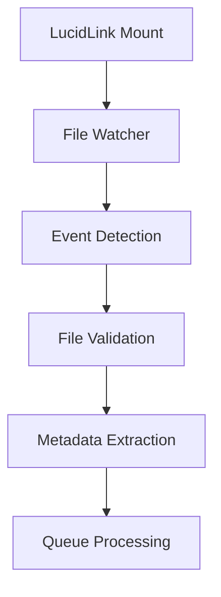
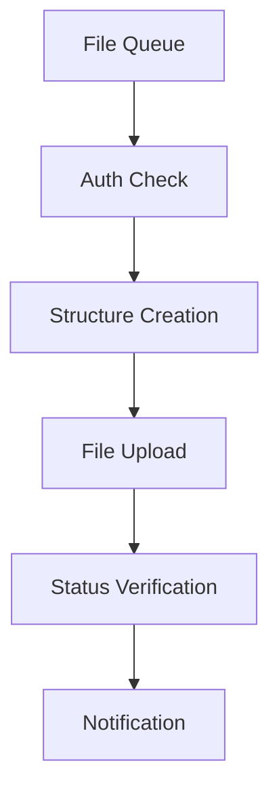
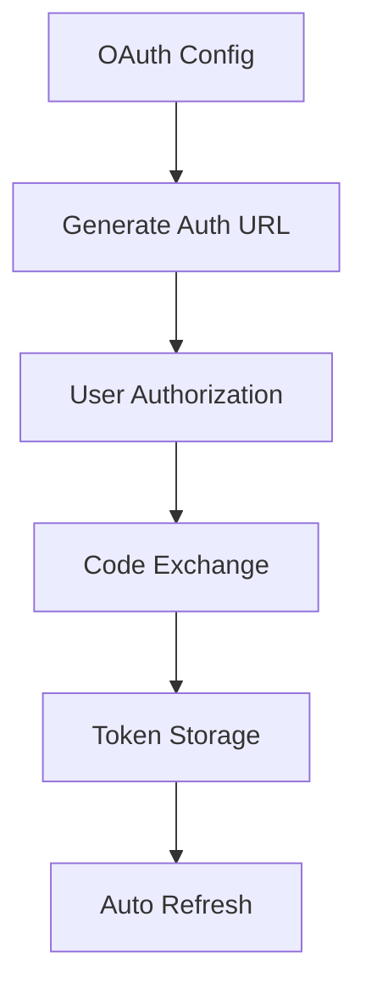

# 🏗️ Architecture RL PostFlow

## 📋 Vue d'ensemble

RL PostFlow est un pipeline modulaire d'intégration entre LucidLink et Frame.io, conçu avec une architecture microservices pour la scalabilité et la maintenabilité.

## 🎯 Principes de Design

### 🔧 Modularité
- **Modules autonomes** : Chaque module est self-contained
- **Interfaces standardisées** : APIs cohérentes entre modules
- **Couplage faible** : Dépendances minimales entre composants

### 🔐 Sécurité
- **OAuth Web App** : Authentification moderne via Adobe IMS
- **Gestion des secrets** : Configuration sécurisée
- **Tokens automatiques** : Refresh et gestion d'expiration

### 🚀 Performance
- **Asynchrone** : Opérations non-bloquantes avec asyncio
- **Upload parallèle** : Traitement concurrent des fichiers
- **Retry intelligent** : Backoff exponentiel pour la robustesse

## 🏗️ Architecture Générale

```
┌─────────────────────────────────────────────────────────────┐
│                     RL PostFlow                            │
├─────────────────────────────────────────────────────────────┤
│                                                             │
│  ┌─────────────┐    ┌─────────────┐    ┌─────────────┐     │
│  │   Watcher   │    │   Parser    │    │  Dashboard  │     │
│  │ (LucidLink) │    │ (Metadata)  │    │    (Web)    │     │
│  └─────────────┘    └─────────────┘    └─────────────┘     │
│         │                   │                   │          │
│         └───────────────────┼───────────────────┘          │
│                             │                              │
│  ┌─────────────────────────────────────────────────────────┤
│  │            Integration Manager                          │
│  │  ┌─────────────┐  ┌─────────────┐  ┌─────────────┐     │
│  │  │    Auth     │  │  Structure  │  │   Upload    │     │
│  │  │ (OAuth)     │  │ (Frame.io)  │  │ (Files)     │     │
│  │  └─────────────┘  └─────────────┘  └─────────────┘     │
│  └─────────────────────────────────────────────────────────┤
│                             │                              │
│  ┌─────────────┐    ┌─────────────┐    ┌─────────────┐     │
│  │   Logger    │    │  Notifier   │    │   Config    │     │
│  │  (Logs)     │    │ (Discord)   │    │ (Settings)  │     │
│  └─────────────┘    └─────────────┘    └─────────────┘     │
│                                                             │
└─────────────────────────────────────────────────────────────┘
```

## 📦 Structure des Modules

### 🔍 Core Pipeline

```
src/
├── core/
│   ├── pipeline.py          # Orchestrateur principal
│   ├── orchestrator.py      # Coordination des tâches
│   └── scheduler.py         # Planification des jobs
```

### 🔌 Intégrations

```
src/integrations/
├── frameio/
│   ├── auth.py             # 🔐 Authentification OAuth autonome
│   ├── integration.py      # 🎭 Gestionnaire principal
│   ├── structure.py        # 📁 Workspaces/Projets
│   ├── upload.py          # 📤 Upload de fichiers
│   ├── comments.py        # 💬 Gestion commentaires
│   ├── parser.py          # 🔍 Parsing métadonnées
│   └── notifier.py        # 📢 Notifications
├── lucidlink/
│   ├── watcher.py         # 👁️ Surveillance fichiers
│   ├── scanner.py         # 🔍 Scan répertoires
│   └── validator.py       # ✅ Validation fichiers
└── discord/
    ├── notifier.py        # 📢 Notifications Discord
    └── formatter.py       # 🎨 Formatage messages
```

### 🎛️ Services

```
src/services/
├── dashboard/
│   ├── server.py          # 🌐 Serveur web
│   ├── api.py            # 🔗 API REST
│   └── templates/        # 🎨 Templates HTML
├── monitoring/
│   ├── metrics.py        # 📊 Métriques
│   ├── health.py         # 🏥 Health checks
│   └── logger.py         # 📝 Logging centralisé
└── config/
    ├── manager.py        # ⚙️ Gestionnaire config
    ├── validator.py      # ✅ Validation config
    └── loader.py         # 📥 Chargement config
```

## 🔄 Flux de Données

### 1. Surveillance LucidLink



### 2. Traitement Frame.io



### 3. Authentification OAuth



## 🔐 Module d'Authentification

### Classe FrameIOAuth

```python
class FrameIOAuth:
    """Gestionnaire d'authentification Frame.io avec OAuth autonome"""
    
    def __init__(self, project_root: Optional[Path] = None)
    
    # Configuration
    def _load_oauth_config(self) -> Dict[str, str]
    def _load_current_tokens(self) -> Dict[str, Any]
    def _save_tokens(self, token_data: Dict[str, Any]) -> None
    
    # Authentification
    def generate_auth_url(self, state: Optional[str] = None) -> str
    async def exchange_code(self, authorization_code: str) -> Dict[str, Any]
    async def refresh_token(self) -> Dict[str, Any]
    async def ensure_valid_token(self) -> bool
    
    # Requêtes HTTP
    async def request(self, method: str, url: str, **kwargs) -> httpx.Response
    async def get(self, url: str, **kwargs) -> httpx.Response
    async def post(self, url: str, **kwargs) -> httpx.Response
    
    # Utilitaires
    def is_token_valid(self) -> bool
    async def test_connection(self) -> bool
```

### Flux d'Authentification

```python
# 1. Initialisation
auth = FrameIOAuth()

# 2. Vérification du token
if not auth.is_token_valid():
    # 3. Génération URL d'autorisation
    auth_url = auth.generate_auth_url()
    
    # 4. Échange du code (après redirection)
    await auth.exchange_code(authorization_code)

# 5. Utilisation automatique
response = await auth.get('/me')
```

## 📊 Gestion des Configurations

### Hiérarchie de Configuration

```
1. Variables d'environnement    (priorité maximale)
2. Fichiers config/            (configuration principale)
3. Paramètres par défaut       (fallback)
```

### Fichiers de Configuration

```
config/
├── integrations.json         # Configuration des intégrations
├── frameio_config.json      # Configuration spécifique Frame.io
├── error_handling.json      # Gestion d'erreurs
├── integrations.json.example # Template de configuration
└── pipeline_config.json     # Configuration du pipeline
```

### Exemple de Configuration

```json
{
  "frameio": {
    "default_project_id": "project-123",
    "default_workspace_id": "workspace-456",
    "upload_timeout": 300,
    "max_retries": 3,
    "chunk_size": 1048576
  },
  "lucidlink": {
    "mount_path": "/path/to/lucidlink",
    "watch_directories": ["Projects", "Renders"],
    "file_extensions": [".mp4", ".mov", ".avi"],
    "ignore_patterns": ["*.tmp", ".*"]
  },
  "discord": {
    "webhook_url": "https://discord.com/api/webhooks/...",
    "enabled": true,
    "notifications": {
      "upload_success": true,
      "upload_error": true,
      "daily_summary": true
    }
  }
}
```

## 🚦 Gestion d'Erreurs

### Stratégie de Retry

```python
# Backoff exponentiel
async def _request_with_retry(self, method: str, url: str, **kwargs):
    for attempt in range(self.max_retries):
        try:
            response = await client.request(method, url, **kwargs)
            
            # Gestion token expiré
            if response.status_code == 401:
                await self.ensure_valid_token()
                continue
            
            return response
            
        except httpx.RequestError as e:
            if attempt == self.max_retries - 1:
                raise
            await asyncio.sleep(2 ** attempt)  # 1s, 2s, 4s, 8s...
```

### Codes d'Erreur

| Code | Description | Action |
|------|-------------|--------|
| 401 | Token expiré | Refresh automatique |
| 403 | Permissions insuffisantes | Log + notification |
| 404 | Ressource non trouvée | Skip + log |
| 429 | Rate limit | Backoff + retry |
| 5xx | Erreur serveur | Retry avec backoff |

## 📊 Monitoring et Métriques

### Métriques Collectées

```python
# Performance
upload_duration_seconds
file_processing_rate
api_response_time

# Fiabilité
upload_success_rate
token_refresh_count
error_rate_by_type

# Utilisation
active_watchers_count
queue_size
concurrent_uploads
```

### Health Checks

```python
# Vérifications système
- LucidLink mount accessible
- Frame.io API disponible
- Token OAuth valide
- Discord webhook actif
- Espace disque disponible
```

## 🔧 Extensibilité

### Ajout d'une Nouvelle Intégration

1. **Créer le module** : `src/integrations/nouvelle_integration/`
2. **Implémenter l'interface** : Hériter de `BaseIntegration`
3. **Ajouter la configuration** : Dans `config/integrations.json`
4. **Enregistrer dans le pipeline** : `src/core/pipeline.py`

### Interface d'Intégration

```python
from abc import ABC, abstractmethod

class BaseIntegration(ABC):
    @abstractmethod
    async def initialize(self) -> bool:
        """Initialiser l'intégration"""
    
    @abstractmethod
    async def process_file(self, file_path: Path) -> bool:
        """Traiter un fichier"""
    
    @abstractmethod
    async def cleanup(self) -> None:
        """Nettoyage des ressources"""
```

## 📝 Logging et Debugging

### Structure des Logs

```
logs/
├── postflow.log           # Log principal
├── frameio.log           # Logs Frame.io
├── lucidlink.log         # Logs LucidLink
├── auth.log              # Logs authentification
└── error.log             # Erreurs uniquement
```

### Configuration du Logging

```python
import logging

# Configuration centralisée
logging.basicConfig(
    level=logging.INFO,
    format='%(asctime)s - %(name)s - %(levelname)s - %(message)s',
    handlers=[
        logging.FileHandler('logs/postflow.log'),
        logging.StreamHandler()
    ]
)
```

---

**Documentation technique mise à jour le : 7 juillet 2025**  
**Version : 4.0.0**  
**Audience : Développeurs et architectes**
